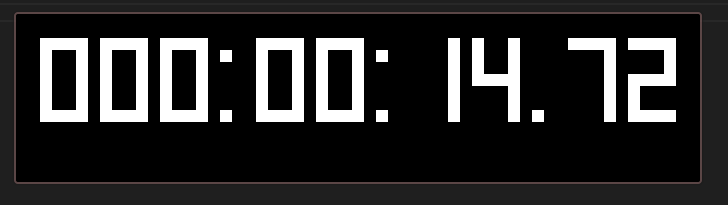
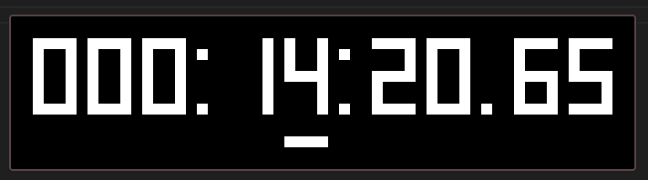

# NamTimer 🐾✨
A simple timer made in C++20 and SDL2, possibly useful for speedrunners or marathoners nya~ (≧▽≦)

Features a way to easily save your time, saved to the directory you run the executable from 🌸🐱.

## General Controls 💖
L - Toggles pause and play nya~ (≧◡≦)

M - Resets and pauses the timer meow~ 🐾

## Controls When Paused 🌸✨
Left/Right - Moves the cursor left/right (wraps around) nya~ 🐱

0-9 - Sets the selected digit to the pressed number 💖

Ctrl+0-9 - Loads the corresponding .clk file 🌸✨

Ctrl+Shift+0-9 - Saves the current time to the corresponding .clk file. Will ask you to confirm by pressing the same key combination again meow~ 🐾. Press Escape to cancel nya~ (≧▽≦)

## UDP Socket (port 7693 by default) 💻🐱
Sending 'PPPPPPPP' will toggle pause and play 🌸✨

Sending 'RRRRRRRR' will reset and pause the timer nya~ 🐾

## Screenshots 🌸

